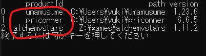
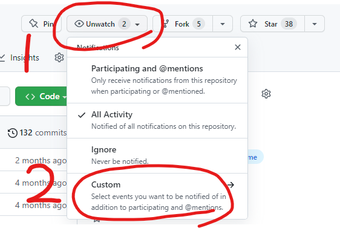
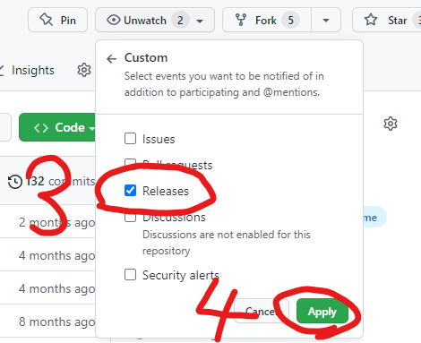

# DMMGamePlayerFastLauncher

DMM Game Player のゲームを高速かつセキュアに起動できるランチャー

[日本語](/README.md) / [English](/README-en.md)

[詳しい使い方](/docs/README-advance.md)

## 特徴

- **ワンクリックでゲームを起動**
- **最低限の権限で起動**
- **DMM にハードウェア情報を送信しない**

## インストール

[Releases](https://github.com/fa0311/DMMGamePlayerFastLauncher/releases) から `DMMGamePlayerFastLauncher-Setup.exe` をダウンロード  
実行してセットアップする

## 使い方

`%AppData%\DMMGamePlayerFastLauncher\tools` にある `DMMGamePlayerProductIdChecker.exe` を実行する  
起動したいゲームの `product_id` をメモする

エクスプローラーやデスクトップで右クリックし**新規作成**、**ショートカットの作成**を選択  
**項目の場所を入力して下さい**に**DMMGamePlayerFastLauncher のパス**と `product_id` を入力

例:  
`%AppData%\DMMGamePlayerFastLauncher\DMMGamePlayerFastLauncher.exe umamusume`  
`%AppData%\DMMGamePlayerFastLauncher\DMMGamePlayerFastLauncher.exe priconner`

**ショートカットの名前**は何でも良い

あとはショートカットをダブルクリックして実行するだけ

## アップデート通知を受け取る

このツールにアップデートがあった時に通知します

## 典拠

[Lutwidse/priconner_launch.py](https://gist.github.com/Lutwidse/82d8e7a20c96296bc0318f1cb6bf26ee)

## ライセンス

DMMGamePlayerFastLauncher is under MIT License
