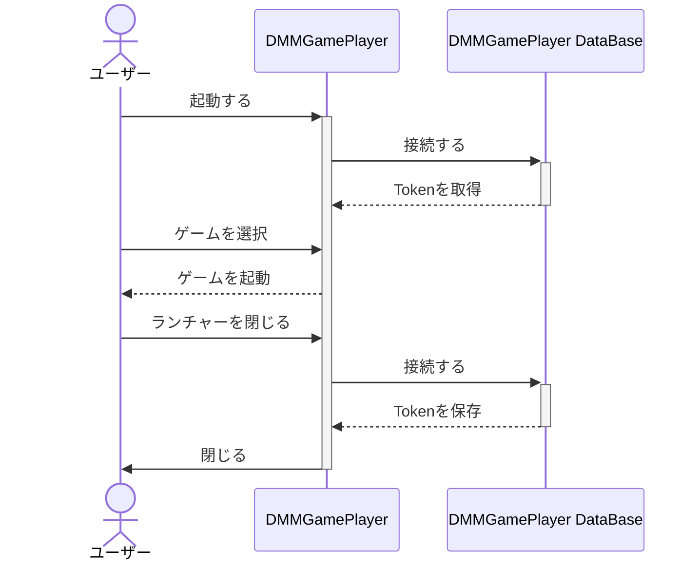
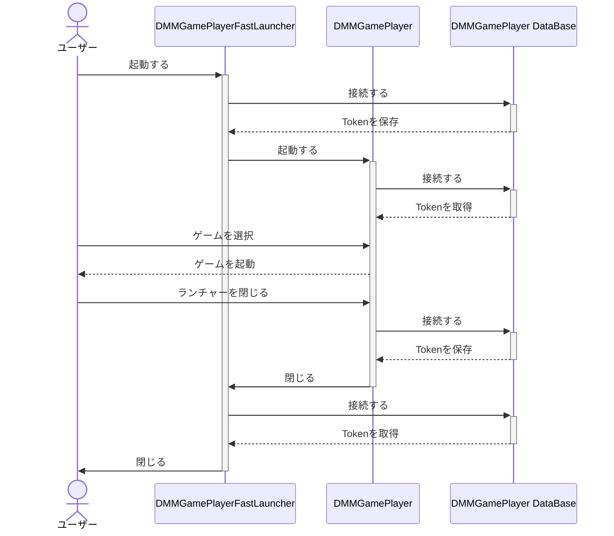

# 詳しい使い方

[日本語](/README.md) / [English](/README-en.md)

## チュートリアル

1. アカウントをDMMGamePlayerからインポートする
   1. DMMGamePlayerにログインしていることを確認する
   2. DMMGamePlayerFastLauncherの `アカウント` -> `インポート` を開く
   3. `ファイル名` に任意の名前を付けインポートする

2. ランチャーのショートカットを作成する
   1. DMMGamePlayerFastLauncherの `ショートカット` -> `ランチャー作成` を開く
   2. `1-3` でインポートしたアカウントを選択して保存する

3. ゲームのショートカットを作成する
    1. DMMGamePlayerFastLauncherの `ショートカット` -> `作成` を開く
    2. `ファイル名` `product_id` `アカウントの選択` などを入力して保存する

インポートしたアカウントでDMMGamePlayerを起動したい場合は必ず `ランチャーのショートカット` を作成して起動してください。ログインし直す必要を回避するためです。

## 技術的な話

DMMGamePlayer はだいたいこのような流れで動作しています。
DMMGamePlayerFastLauncher もこの流れに似ています。独自のDatabaseを持っているため DMMGamePlayer に一切依存せずにゲームを起動します。

---

DMMGamePlayerFastLauncher 経由で DMMGamePlayer を起動する場合は少し複雑です。
まず、DMMGamePlayer の Database に保存されている情報を DMMGamePlayerFastLauncher が持っているアカウント情報で上書きします。
その後に DMMGamePlayer を起動します。
DMMGamePlayer が終了すると DMMGamePlayerFastLauncher が DMMGamePlayer の Database に接続して アカウント情報 を取得します。

