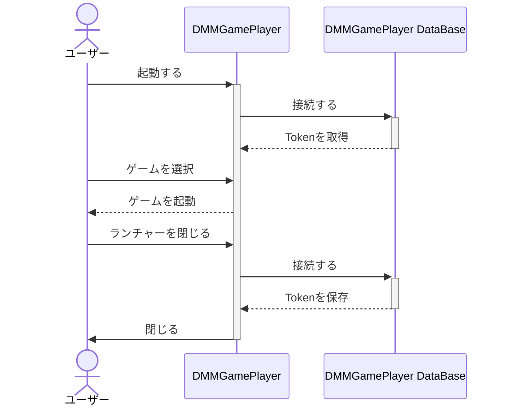
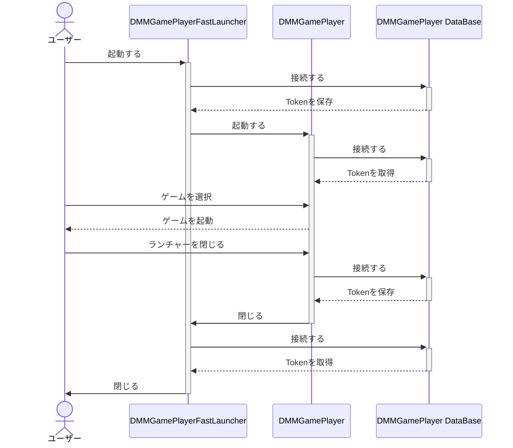

# 詳しい使い方

[日本語](/README.md) / [English](/README-en.md)

## チュートリアル

1. アカウントをDMMGamePlayerからインポートする
   1. DMMGamePlayerにログインしていることを確認する
   2. DMMGamePlayerFastLauncherの `アカウント` -> `インポート` を開く
   3. `ファイル名` に任意の名前を付けインポートする

2. ランチャーのショートカットを作成する
   1. DMMGamePlayerFastLauncherの `ショートカット` -> `ランチャー作成` を開く
   2. `1-3` でインポートしたアカウントを選択して保存する

3. ゲームのショートカットを作成する
    1. DMMGamePlayerFastLauncherの `ショートカット` -> `作成` を開く
    2. `ファイル名` `product_id` `アカウントの選択` などを入力して保存する

インポートしたアカウントでDMMGamePlayerを起動したい場合は必ず `ランチャーのショートカット` を作成して起動してください。ログインし直す必要を回避するためです。

## DRMで保護されたゲームを起動する(デバイス認証が必要なゲーム)

起動時に `Exception: failed to authenticate device` というエラーが出る場合はデバイス認証が必要なゲームです。

1. [チュートリアル](#チュートリアル) と同じ手順でゲームのショートカットを作成する
2. デバイス認証を行う
   1. DMMGamePlayerFastLauncherの `アカウント` -> `デバイス登録` を開く
   2. `アカウントの選択` を入力してアカウントを選択し `認証コードを送信` する
   3. `デバイス名` と `デバイス認証コード` を入力して `認証` をする

## デバイス認証の5台制限を回避する

1. デバイス情報を共通にする
   1. いずれかのデバイスで `設定` -> `デバイス登録` を開き表示されている情報をメモする
   2. 全てのデバイスで `設定` -> `デバイス登録` を開き `1-1` でメモした情報に書き換える

## 技術的な話

### ログイン

DMMGamePlayer は複数に同時にログインすることができません。例えば DMMGamePlayer と DMMGamePlayerFastLauncher で同時にログインすることはできません。
この問題を回避するために DMMGamePlayerFastLauncher は DMMGamePlayer に一切依存せずにゲームを起動します。
DMMGamePlayerFastLauncherでログインしているため DMMGamePlayer を起動する場合は少し細工をしてあげる必要があります。DMMGamePlayerFastLauncher から DMMGamePlayer を起動することで自動的に細工をしてくれます。

---

DMMGamePlayer はだいたいこのような流れで動作しています。
DMMGamePlayerFastLauncher もこの流れに似ています。独自のDatabaseを持っているため DMMGamePlayer に一切依存せずにゲームを起動します。

---

DMMGamePlayerFastLauncher 経由で DMMGamePlayer を起動する場合は少し複雑です。
まず、DMMGamePlayer の Database に保存されている情報を DMMGamePlayerFastLauncher が持っているアカウント情報で上書きします。
その後に DMMGamePlayer を起動します。
DMMGamePlayer が終了すると DMMGamePlayerFastLauncher が DMMGamePlayer の Database に接続して アカウント情報 を取得します。

### デバイス認証(DRM)

割れ防止のためにDMMGamePlayerはデバイス認証を行っています。
デバイス認証でアカウントとハードウェアの情報を紐つけています。
ハードウェアの情報はリクエストを送信するたびに送信されています。

DMMGamePlayerが収集するハードウェアの情報は以下の通りです。

- Macアドレス
- ディスクのシリアル番号
- マザーボードのシリアル番号

DMMGamePlayerFastLauncherはそれらを偽装してDMMに送信します。

DMMGamePlayerでの認証が通ると `~/.DMMGamePlayer/{product_idのbase64エンコード}` に認証情報が保存されます。
ゲームはそれを読み取って認証情報が誤っていないかを確認します。
