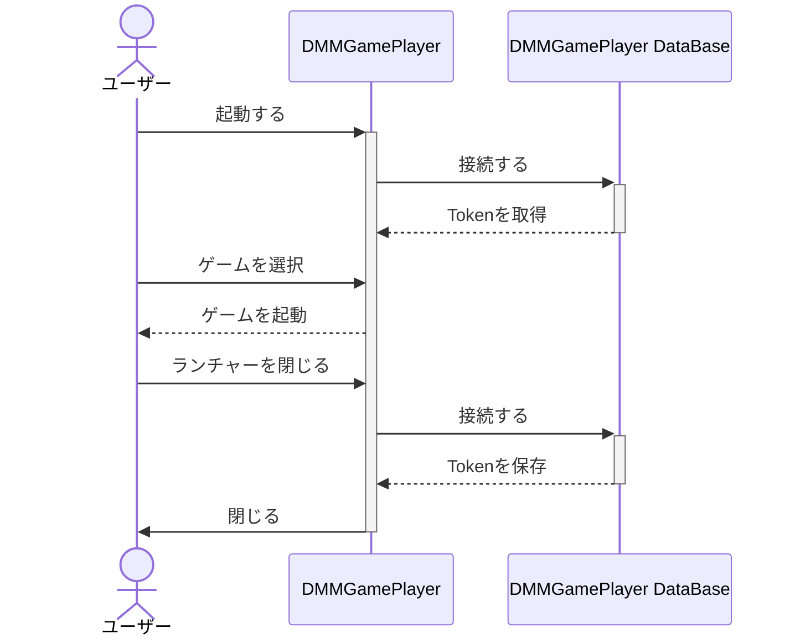
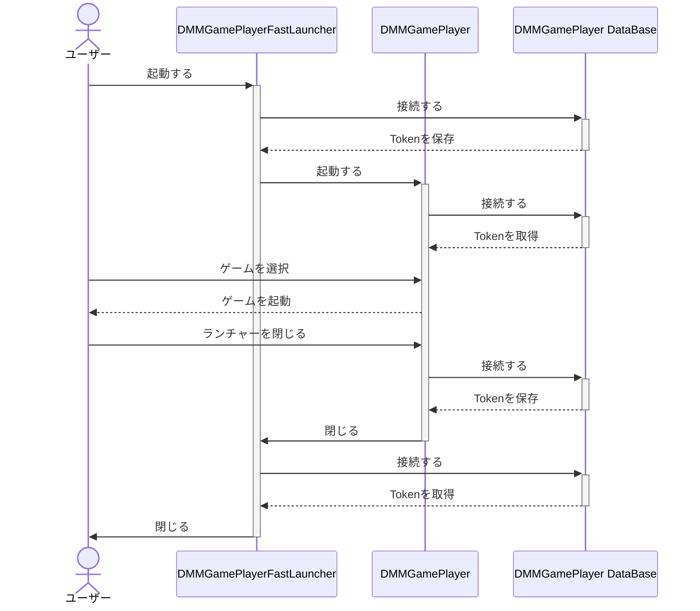

# 詳しい使い方

[日本語](/README.md) / [English](/README-en.md)

## 起動方法

1. エクスプローラーのアドレスバーに `%AppData%\DMMGamePlayerFastLauncher` と入力しフォルダを移動する。
2. `DMMGamePlayerFastLauncher` をクリックして実行する。

## チュートリアル

1. アカウントをDMMGamePlayerからインポートをする
   1. 始めにDMMGamePlayerにログインしていることを確認します。
   2. DMMGamePlayerFastLauncherの `アカウント` 内の `インポート` を開きます。
   3. `ファイル名` に任意の名前を付けてインポートをします。

2. DMMGamePlayerの高速起動を行なうショートカットを作成する
   1. DMMGamePlayerFastLauncherの `ショートカット` 内の `GamePlayerの高速化` を開きます。
   2. `1-3` でインポートしたアカウントを選択をします。
   3. `ショートカットを作成して設定を保存する`をクリックするとショートカットが作成されます。

3. ゲームの高速起動を行なうショートカットを作成する
    1. DMMGamePlayerFastLauncherの `ショートカット` 内の `ショートカットの作成` を開きます。
    2. `ファイル名`の入力 `product_idの選択` `アカウントの選択` `ゲームの引数(任意)`を入力します。その他に、`起動時にゲームの自動更新をする`にチェックを入れるとゲームの起動時に更新を確認して自動更新を行ないます。
    3. `UAC自動昇格のショートカットを作成して設定を保存する`をクリックすると「ユーザーアカウント制御の表示をせずに高速起動が可能なショートカットが作成」されます。`ショートカットを作成して設定を保存する`はユーザーアカウント制御の自動昇格を行なわない、「通常の高速起動を行なうショートカットを作成」します。

インポートしたアカウントでDMMGamePlayerを起動したい場合は必ず `GamePlayerの高速化` のショートカットを作成して起動をしてください。再ログインを回避するために必要です。

## 動作が不安定な場合

動作が不安定な場合は以下の手順をお試しください

- ウイルス対策ソフトを一時的に無効化する。
- Windows Defenderを無効にする。
- ゲームの権限をインストール時の状態に戻す。
- DMMGamePlayerの基本設定をデフォルトに戻す。
  - `コンピューター起動時にDMM GAME PLAYERを実行` のチェックを外す。
  - `バックグラウンド実行を許可する` のチェックを外す。
- ファイル名から日本語を削除し半角英数字のみにする。

それでも解決しないまたは、再現性の高い不具合については [issues](https://github.com/fa0311/DMMGamePlayerFastLauncher/issues/new/choose) から報告をしてください。

## DRMで保護されたゲームを起動するには(デバイス認証が必要なゲームについて)

起動時に `Exception: failed to authenticate device` というエラーが出る場合はデバイス認証が必要なゲームです。

1. [チュートリアル](#チュートリアル) と同じ手順でゲームのショートカットを作成してください。
2. デバイス認証を行う
   1. DMMGamePlayerFastLauncherの `アカウント` 内の `デバイスの登録` を開きます。
   2. `ファイルの選択` をクリックし、認証を行なうアカウントを選択します。
   3. `認証コードを送信する` をクリックするとそのDMMアカウントに登録をしたメールアドレスに認証コードが届きます。
   4. `デバイス名` と `デバイス認証コード` を入力後に `認証` をクリックでデバイス認証がされます。

## デバイス認証の5台制限を回避するには

1. デバイス情報を共通にする
   1. 回避元のデバイスで `設定` 内の `デバイスの登録` を開いてデバイス情報をメモしてください。
   2. 回避をしたいデバイスで `設定` 内の `デバイスの登録` を開き、 `1-1` でメモをしたデバイス情報に変更をしてください。

## コマンドラインで実行する

GUI の動作が不安定で上手くショートカットが作成されない場合や高度な自動化を行いたい場合、コマンドラインを使用して動作させることができます。

コマンドを実行した権限と同じ権限でゲームが実行されます。
つまりこの方法だけでは、UAC自動昇格が行われないので `RunAs` や [sudo](https://bjansen.github.io/scoop-apps/main/sudo/) と組み合わせて使用する必要があります。
タスクスケジューラを使用する DMMGamePlayerFastLauncher の解説は [タスクスケジューラ](#タスクスケジューラ) で行います。

```ps1
DMMGamePlayerFastLauncher.exe [ID] [--type TYPE]
```

- `ID`: 起動するゲームもしくはアカウントのファイル名。省略するとGUIが起動します。
- `--type TYPE`: `game` もしくは `launcher` を指定。

例:

```ps1
# DMMGamePlayerFastLauncher\data\shortcut\priconner.json をもとにゲームを起動します。
DMMGamePlayerFastLauncher.exe priconner --type game
# DMMGamePlayerFastLauncher\data\shortcut\account_shortcut\Karyl.json をもとにゲームを起動します。
DMMGamePlayerFastLauncher.exe Karyl --type launcher
```

## タスクスケジューラ

UAC 自動昇格はタスクスケジューラを使用して行われるので安全です。
`\Microsoft\Windows\DMMGamePlayerFastLauncher` に存在します。

また、`DMMGamePlayerFastLauncher\data\schtasks` にタスクスケジューラのコピーがあります。
コピーをタスクスケジューラに反映させるには `DMMGamePlayerFastLauncher\tools\refresh.ps1` を実行する必要があります。

タスクスケジューラを手動でいじるのはオススメしていません。

## 技術的な話

### ログイン

DMMGamePlayer は複数に同時にログインすることができません。例えば DMMGamePlayer と DMMGamePlayerFastLauncher で同時にログインすることはできません。
この問題を回避するために DMMGamePlayerFastLauncher は DMMGamePlayer に一切依存せずにゲームを起動します。
DMMGamePlayerFastLauncherでログインしているため DMMGamePlayer を起動する場合は少し細工をしてあげる必要があります。DMMGamePlayerFastLauncher から DMMGamePlayer を起動することで自動的に細工をしてくれます。

---

DMMGamePlayer はだいたいこのような流れで動作しています。
DMMGamePlayerFastLauncher もこの流れに似ています。独自のDatabaseを持っているため DMMGamePlayer に一切依存せずにゲームを起動します。



---

DMMGamePlayerFastLauncher 経由で DMMGamePlayer を起動する場合は少し複雑です。
まず、DMMGamePlayer の Database に保存されている情報を DMMGamePlayerFastLauncher が持っているアカウント情報で上書きします。
その後に DMMGamePlayer を起動します。
DMMGamePlayer が終了すると DMMGamePlayerFastLauncher が DMMGamePlayer の Database に接続して アカウント情報 を取得します。



### デバイス認証(DRM)

割れ防止のためにDMMGamePlayerはデバイス認証を行っています。
デバイス認証でアカウントとハードウェアの情報を紐つけています。
ハードウェアの情報はリクエストを送信するたびに送信されています。

DMMGamePlayerが収集するハードウェアの情報は以下の通りです。

- MACアドレス
- HDDのシリアル番号
- マザーボードのシリアル番号

DMMGamePlayerFastLauncherはそれらを偽装してDMMに送信します。
よってログに出力されるMACアドレスなどの情報はすべて偽装されたものです。

DMMGamePlayerでの認証が通ると `~/.DMMGamePlayer/{product_idのbase64エンコード}` に認証情報が保存されます。
ゲームはそれを読み取って認証情報が誤っていないかを確認します。
